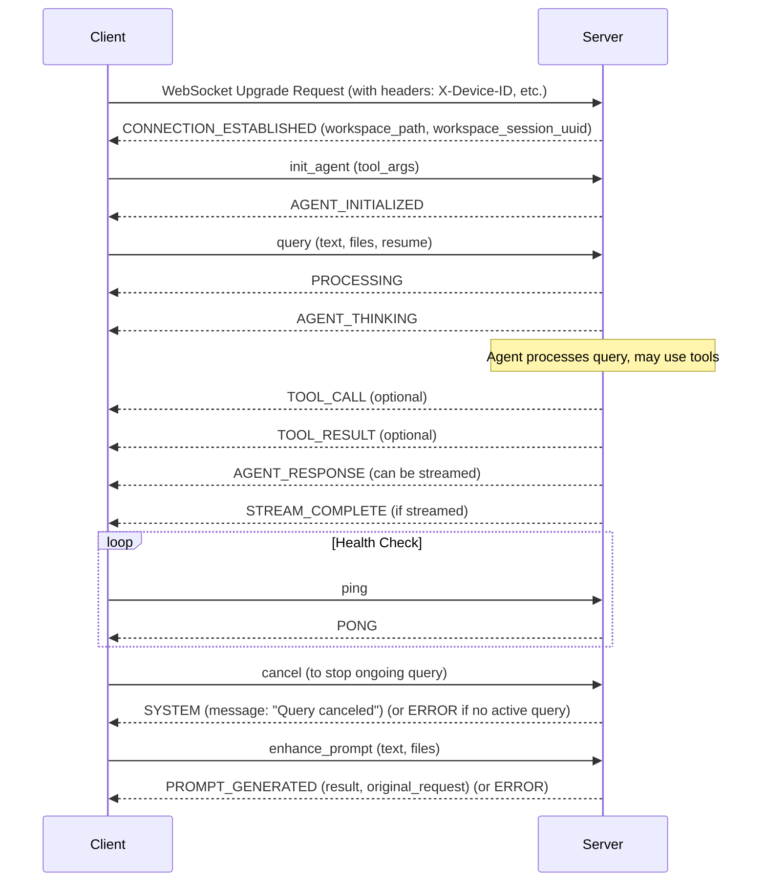

# React Frontend Integration Guide for II-Agent Backend

## 1. Introduction

This guide provides instructions for integrating a React frontend with the II-Agent backend. The backend exposes a WebSocket interface for real-time, bidirectional communication, enabling interactive agent capabilities.

## 2. Establishing WebSocket Connection

### Endpoint
The primary WebSocket endpoint is:
`ws://<your_backend_host>:<port>/ws` (e.g., `ws://localhost:8000/ws`)

### HTTP Headers for Connection
When establishing the WebSocket connection, the following HTTP headers **must** be included in the upgrade request:

*   **`Authorization`**: (Optional) A token for user authentication if your setup requires it. The `ws_server.py` includes a placeholder `fetch_user_id` function that uses this.
*   **`X-API-Key`**: (Optional) An API key if required by the `fetch_user_id` authentication mechanism.
*   **`X-Client-Key`**: (Optional) A client key if required by the `fetch_user_id` authentication mechanism.
*   **`X-Device-ID`**: **Required.** A unique identifier for the client device (e.g., a UUID generated and stored by the frontend). This ID is used by the backend to:
    *   Form a `composite_session_id` (`user_id_device_id`) for tracking and retrieving session history.
    *   Retrieve past sessions associated with this device via the `/api/sessions/{device_id}` endpoint.

### Initial Server Event: `CONNECTION_ESTABLISHED`
Upon successful connection, the server sends the first event:
*   **Type:** `CONNECTION_ESTABLISHED`
*   **Content:**
    ```json
    {
      "message": "Connected to Agent WebSocket Server",
      "workspace_path": "/path/to/workspace/xxxxxxxx-xxxx-xxxx-xxxx-xxxxxxxxxxxx" // Server-side path of the unique session workspace
    }
    ```
    The `workspace_path` is the root directory on the server for this specific session. The last part is a UUID (`workspace_session_uuid`) unique to the connection's workspace. This UUID is important if you need to use the `/api/upload` endpoint.

## 3. Core Interaction Flow

The typical interaction between the frontend and the backend follows this sequence:

1.  **Frontend Connects:** Establishes WebSocket connection with necessary headers.
2.  **Server Responds:** Sends `CONNECTION_ESTABLISHED` event.
3.  **Frontend Initializes Agent:** Sends `init_agent` message.
    *   Payload: `{ "type": "init_agent", "content": { "tool_args": { ... } } }`
    *   `tool_args` can specify initial settings for tools (e.g., `{ "browser": true, "deep_research": false }`).
4.  **Server Responds:** Sends `AGENT_INITIALIZED` event.
    *   Payload: `{ "type": "AGENT_INITIALIZED", "content": { "message": "Agent initialized" } }`
5.  **Frontend Sends Query:** Sends `query` message with user's request.
    *   Payload: `{ "type": "query", "content": { "text": "User's question", "files": ["/uploads/filename.txt"], "resume": false } }`
    *   `files`: Array of paths to files previously uploaded (relative to the workspace's UPLOAD_FOLDER_NAME).
    *   `resume`: Boolean, typically `true` if continuing a previous task, `false` for a new one.
6.  **Server Acknowledges:** Sends `PROCESSING` event.
7.  **Server Thinking:** Sends `AGENT_THINKING` event (may occur multiple times if the agent has multiple thought steps).
8.  **Server Tool Usage (Optional):**
    *   Sends `TOOL_CALL` event before executing a tool.
    *   Sends `TOOL_RESULT` event after tool execution.
9.  **Server Responds to Query:**
    *   Sends `AGENT_RESPONSE` event. This might be a partial response if streaming, or a full response.
    *   If streaming, multiple `AGENT_RESPONSE` events can be sent.
10. **Server Stream Complete (Optional):** Sends `STREAM_COMPLETE` if the response was streamed.

### Sequence Diagram (Mermaid.js)



## 4. WebSocket Message Types (`EventType`)

Messages are exchanged as JSON objects with `type` and `content` fields, corresponding to the `RealtimeEvent` model (`src/ii_agent/core/event.py`).

### Client-to-Server Messages

*   **`init_agent`**
    *   **Direction:** Client -> Server
    *   **Purpose:** To initialize the agent for the current session. Should be sent after `CONNECTION_ESTABLISHED`.
    *   **Payload (`content`):**
        ```json
        {
          "tool_args": { // Optional arguments to configure tools
            "deep_research": false,
            "pdf": true,
            "media_generation": false,
            "audio_generation": false,
            "browser": true 
          }
        }
        ```
    *   **When to Use:** Once, after connection is established and before sending queries.

*   **`query`**
    *   **Direction:** Client -> Server
    *   **Purpose:** To send the user's request/question to the agent.
    *   **Payload (`content`):**
        ```json
        {
          "text": "Your query for the agent.", // Required
          "files": [ "/uploads/file1.txt", "/uploads/image.png" ], // Optional array of file paths (see File Uploads)
          "resume": false // Optional boolean, true to indicate continuation of previous task
        }
        ```
    *   **When to Use:** Whenever the user submits a new request.

*   **`cancel`**
    *   **Direction:** Client -> Server
    *   **Purpose:** To request cancellation of the currently active agent task/query.
    *   **Payload (`content`):** `{}` (Empty)
    *   **When to Use:** When the user wants to stop the agent's current operation.

*   **`enhance_prompt`**
    *   **Direction:** Client -> Server
    *   **Purpose:** To ask the LLM to refine or improve a given user prompt.
    *   **Payload (`content`):**
        ```json
        {
          "text": "Original user prompt to be enhanced.", // Required
          "files": [] // Optional array of file paths relevant to the prompt
        }
        ```
    *   **When to Use:** If you want to offer a feature where the AI helps the user write better prompts.

*   **`ping`**
    *   **Direction:** Client -> Server
    *   **Purpose:** To check if the connection is still alive. Also serves as a keep-alive mechanism.
    *   **Payload (`content`):** `{}` (Empty)
    *   **When to Use:** Periodically (e.g., every 30 seconds) if no other messages are being sent.

*   **`workspace_info`** (Less common for typical frontend use, but available)
    *   **Direction:** Client -> Server
    *   **Purpose:** To request information about the current workspace.
    *   **Payload (`content`):** `{}` (Empty)
    *   **When to Use:** If the client needs to re-fetch workspace details. Server responds with `WORKSPACE_INFO`.

### Server-to-Client Messages

*   **`CONNECTION_ESTABLISHED`**
    *   **Direction:** Server -> Client
    *   **Purpose:** Confirms successful WebSocket connection and provides initial session details.
    *   **Payload (`content`):**
        ```json
        {
          "message": "Connected to Agent WebSocket Server",
          "workspace_path": "/server/side/path/to/workspace/xxxxxxxx-xxxx-xxxx-xxxx-xxxxxxxxxxxx"
        }
        ```
    *   **When to Expect:** Immediately after the WebSocket connection is accepted.

*   **`AGENT_INITIALIZED`**
    *   **Direction:** Server -> Client
    *   **Purpose:** Confirms that the agent has been initialized on the server.
    *   **Payload (`content`):**
        ```json
        {
          "message": "Agent initialized"
        }
        ```
    *   **When to Expect:** After the client sends an `init_agent` message.

*   **`WORKSPACE_INFO`**
    *   **Direction:** Server -> Client
    *   **Purpose:** Provides information about the agent's workspace.
    *   **Payload (`content`):**
        ```json
        {
          "path": "/server/side/path/to/workspace/xxxxxxxx-xxxx-xxxx-xxxx-xxxxxxxxxxxx"
        }
        ```
    *   **When to Expect:** In response to a `workspace_info` request from the client.

*   **`PROCESSING`**
    *   **Direction:** Server -> Client
    *   **Purpose:** Indicates that the server has received the query and is starting to process it.
    *   **Payload (`content`):**
        ```json
        {
          "message": "Processing your request..."
        }
        ```
    *   **When to Expect:** Shortly after a `query` message is sent.

*   **`AGENT_THINKING`**
    *   **Direction:** Server -> Client
    *   **Purpose:** Provides insight into the agent's internal reasoning process or current step.
    *   **Payload (`content`):**
        ```json
        {
          "thought": "The agent's current thought or plan."
          // Other fields might be present depending on agent implementation
        }
        ```
    *   **When to Expect:** During query processing, before or between tool calls and the final response. Can occur multiple times.

*   **`TOOL_CALL`**
    *   **Direction:** Server -> Client
    *   **Purpose:** Informs the client that the agent is about to call a specific tool.
    *   **Payload (`content`):** (Structure can vary based on tool)
        ```json
        {
          "tool_name": "NameOfTheTool",
          "tool_input": { /* arguments for the tool */ }
          // Potentially other details like a unique call ID
        }
        ```
    *   **When to Expect:** When the agent decides to use a tool to fulfill the query.

*   **`TOOL_RESULT`**
    *   **Direction:** Server -> Client
    *   **Purpose:** Provides the outcome/result from a tool execution.
    *   **Payload (`content`):** (Structure can vary based on tool)
        ```json
        {
          "tool_name": "NameOfTheTool",
          "tool_output": { /* result from the tool */ },
          "status": "success" // or "error"
          // Potentially other details
        }
        ```
    *   **When to Expect:** After a `TOOL_CALL` event, once the tool has finished running.

*   **`AGENT_RESPONSE`**
    *   **Direction:** Server -> Client
    *   **Purpose:** The agent's actual response to the user's query. This can be a complete response or a chunk of a streamed response.
    *   **Payload (`content`):**
        ```json
        {
          "text_delta": "Part of the agent's response.", // For streamed text
          "full_text": "The complete agent's response." // May appear at the end of a stream or for non-streamed responses
          // Other fields might include sources, images, etc.
        }
        ```
    *   **When to Expect:** After processing and potentially using tools. Can be multiple events if streaming.

*   **`STREAM_COMPLETE`**
    *   **Direction:** Server -> Client
    *   **Purpose:** Signals that all parts of a streamed `AGENT_RESPONSE` have been sent.
    *   **Payload (`content`):**
        ```json
        {
          "message": "Stream completed."
        }
        ```
    *   **When to Expect:** After the last `AGENT_RESPONSE` chunk in a streamed response.

*   **`ERROR`**
    *   **Direction:** Server -> Client
    *   **Purpose:** Indicates an error occurred on the server.
    *   **Payload (`content`):**
        ```json
        {
          "message": "A description of the error.",
          "details": "Optional further details about the error."
        }
        ```
    *   **When to Expect:** At any point if an error occurs (e.g., invalid message from client, agent error, authentication failure).

*   **`SYSTEM`**
    *   **Direction:** Server -> Client
    *   **Purpose:** For general system messages or notifications.
    *   **Payload (`content`):**
        ```json
        {
          "message": "System message, e.g., 'Query canceled'."
        }
        ```
    *   **When to Expect:** For events like successful cancellation.

*   **`PONG`**
    *   **Direction:** Server -> Client
    *   **Purpose:** The server's response to a client's `ping` message.
    *   **Payload (`content`):** `{}` (Empty)
    *   **When to Expect:** In response to a `ping`.

*   **`UPLOAD_SUCCESS`** (Note: File uploads are primarily handled via HTTP, but a WebSocket message might confirm processing if designed that way. The current `ws_server.py` does not send this specific WS event for HTTP uploads.)
    *   **Direction:** Server -> Client
    *   **Purpose:** Confirms a file related to the session was successfully processed (if applicable via WS).
    *   **Payload (`content`):**
        ```json
        {
          "message": "File processed successfully.",
          "file_path": "/uploads/filename.txt"
        }
        ```

*   **`BROWSER_USE`**
    *   **Direction:** Server -> Client
    *   **Purpose:** Indicates the agent is using or has used a browser tool.
    *   **Payload (`content`):** (Content can vary, e.g., URL visited, screenshot path)
        ```json
        {
          "status": "fetching", // "success", "error"
          "url": "http://example.com",
          "screenshot_path": "/workspace/xxx-uuid-xxx/screenshots/screenshot.png" // Path relative to server workspace
        }
        ```
    *   **When to Expect:** When the browser tool is active.

*   **`FILE_EDIT`**
    *   **Direction:** Server -> Client
    *   **Purpose:** Informs that the agent has edited a file in its workspace.
    *   **Payload (`content`):**
        ```json
        {
          "file_path": "path/to/edited/file.py", // Relative to agent's workspace
          "operation": "write", // "delete", "create"
          "status": "success"
        }
        ```
    *   **When to Expect:** After a file operation tool is used.

*   **`USER_MESSAGE`** (Primarily for server-side logging/DB storage, but could be echoed if needed)
    *   **Direction:** Server -> Client (If echoed)
    *   **Purpose:** Represents a message sent by the user, often logged by the server.
    *   **Payload (`content`):**
        ```json
        {
          "text": "The user's original message."
        }
        ```

*   **`PROMPT_GENERATED`**
    *   **Direction:** Server -> Client
    *   **Purpose:** The server's response to an `enhance_prompt` request.
    *   **Payload (`content`):**
        ```json
        {
          "result": "The enhanced prompt text.",
          "original_request": "The original prompt text sent by the client."
        }
        ```
    *   **When to Expect:** In response to an `enhance_prompt` message.

## 5. File Uploads

Files are uploaded to the agent's workspace via a separate HTTP POST endpoint, not directly through WebSocket.

*   **Endpoint:** `POST /api/upload`
*   **Request Body (JSON):**
    ```json
    {
      "session_id": "xxxxxxxx-xxxx-xxxx-xxxx-xxxxxxxxxxxx", // This is the workspace_session_uuid obtained from CONNECTION_ESTABLISHED or from session history
      "file": {
        "path": "my_document.pdf", // Desired filename in the upload directory
        "content": "data:application/pdf;base64,JVBERi0xLjcKJeLjz9MKN..." // File content, either as a base64 data URL or plain text
      }
    }
    ```
    *   `session_id`: The UUID of the workspace directory (e.g., `workspace_session_uuid` from the `CONNECTION_ESTABLISHED` event's `workspace_path` field, by taking the last component of the path).
    *   `file.path`: The name you want the file to have within the server's upload folder (e.g., `UPLOAD_FOLDER_NAME` which is "uploads").
    *   `file.content`: For binary files, use a base64 encoded data URL (e.g., `data:image/png;base64,...`). For text files, plain text content is also acceptable.
*   **Response Body (JSON):**
    ```json
    {
      "message": "File uploaded successfully",
      "file": {
        "path": "/uploads/my_document.pdf", // Path relative to the workspace, to be used in `query` messages
        "saved_path": "/server/side/workspace/uuid/uploads/my_document.pdf" // Full server-side path where file was saved
      }
    }
    ```
    *   The `file.path` (e.g., `/uploads/my_document.pdf`) is what you should use in the `files` array when sending a `query` message to the agent, so it can find the file within its workspace.

## 6. Session Management & History

The backend provides HTTP endpoints to retrieve session history, primarily using the `X-Device-ID` and the `composite_session_id`.

*   **Get Sessions by Device ID:**
    *   **Endpoint:** `GET /api/sessions/{device_id}`
    *   **Purpose:** Retrieves a list of all past sessions associated with a given `device_id`.
    *   **Response:** A JSON object containing a list of sessions, including their `id` (which is the `composite_session_id`), `workspace_dir`, `created_at`, `first_message`, etc.
        ```json
        {
          "sessions": [
            {
              "id": "user123_deviceABC_timestampXYZ", // composite_session_id
              "workspace_dir": "/path/to/workspace/xxxxxxxx-xxxx-xxxx-xxxx-xxxxxxxxxxxx",
              "created_at": "YYYY-MM-DDTHH:MM:SS.ffffff",
              "first_message": "Initial query from that session",
              // ... other session details
            }
          ]
        }
        ```
*   **Get Events for a Session:**
    *   **Endpoint:** `GET /api/sessions/{session_id}/events`
        *   Note: The `{session_id}` here is the `composite_session_id` (e.g., `user123_deviceABC_timestampXYZ`) obtained from the `/api/sessions/{device_id}` endpoint.
    *   **Purpose:** Retrieves all events (messages, tool calls, responses) for a specific session.
    *   **Response:** A JSON object containing a list of events, sorted by timestamp. Each event matches the `RealtimeEvent` structure.
        ```json
        {
          "events": [
            {
              "id": "event_db_id",
              "session_id": "user123_deviceABC_timestampXYZ",
              "timestamp": "YYYY-MM-DDTHH:MM:SS.ffffff",
              "event_type": "USER_MESSAGE", // or AGENT_RESPONSE, TOOL_CALL, etc.
              "event_payload": { /* content of the event */ }
            }
          ]
        }
        ```

*   **Resuming Sessions:** While there isn't a direct "resume session" WebSocket message, you can achieve a similar effect:
    1.  Fetch session history to get past interactions.
    2.  When sending a `query`, you can set the `resume: true` flag. The agent logic might use this hint, but the primary context is rebuilt from its message history for that session ID.
    3.  To truly "resume," ensure you are using the same `X-Device-ID` and the backend correctly identifies the user to form the same `composite_session_id`. The agent will then load its history associated with that `composite_session_id`.

## 7. Error Handling

*   **`ERROR` Event:** The server will send an `ERROR` message type if something goes wrong.
    *   **Payload:** `{ "message": "Error description", "details": "Optional details" }`
    *   **Examples:** User authentication failure, invalid message format, agent internal error, query processing error.
*   **Frontend Strategies:**
    *   Display user-friendly error messages.
    *   Log detailed errors for debugging.
    *   Implement retry mechanisms for transient network issues when establishing connection.
    *   Handle cases where `fetch_user_id` might fail (if using authentication).

## 8. Fallback Mechanisms

*   **WebSocket Connection Drops:**
    *   Attempt to reconnect automatically (with exponential backoff).
    *   Notify the user about the disconnection and reconnection attempts.
    *   If reconnected, you might need to re-initialize the agent (`init_agent`).
*   **No Response / Timeout:**
    *   Implement client-side timeouts for operations (e.g., waiting for `AGENT_RESPONSE` after a `query`).
    *   If a timeout occurs, inform the user. Offer options like "Cancel" (send `cancel` message) or "Retry".
*   **`/api/upload` Failure:** Handle HTTP error codes (4xx, 5xx) and inform the user.

## 9. Best Practices

*   **Ping/Pong:** Send `ping` messages periodically to keep the WebSocket connection alive, especially during periods of inactivity. The server will respond with `PONG`.
*   **Message Size:** Be mindful of very large message payloads. For large data (like files), use the `/api/upload` HTTP endpoint.
*   **Graceful Disconnection:** When the frontend is closing (e.g., user closes tab/browser), try to send a `websocket.close()` command if possible. The server also handles abrupt disconnections.
*   **UI Feedback:** Provide clear UI feedback for different states: connecting, initializing agent, processing query, agent thinking, tool usage, receiving response, errors.
*   **Concurrency:** A single WebSocket connection typically handles one active query at a time. If a query is in progress, the server will return an error if another `query` message is sent before the current one completes (as seen in `ws_server.py`). Use the `cancel` message if the user needs to interrupt.

## 10. Example Interaction (JSON snippets)

**1. Connection and Initialization**
```
// Client sends (after WS connection established with X-Device-ID header)
--> { "type": "init_agent", "content": {} }

// Server responds
<-- { "type": "AGENT_INITIALIZED", "content": { "message": "Agent initialized" } }
```

**2. Sending a Query**
```
// Client sends
--> { "type": "query", "content": { "text": "What is the weather in London?" } }

// Server responds (sequence)
<-- { "type": "PROCESSING", "content": { "message": "Processing your request..." } }
<-- { "type": "AGENT_THINKING", "content": { "thought": "I need to find the weather in London." } }
<-- { "type": "TOOL_CALL", "content": { "tool_name": "WebSearchTool", "tool_input": {"query": "weather in London"} } }
<-- { "type": "TOOL_RESULT", "content": { "tool_name": "WebSearchTool", "tool_output": {"result": "The weather in London is sunny, 20°C."}, "status": "success" } }
<-- { "type": "AGENT_RESPONSE", "content": { "text_delta": "The weather in London is sunny, 20°C." } } // Or full_text
<-- { "type": "STREAM_COMPLETE", "content": { "message": "Stream completed." } } // If streamed
```
